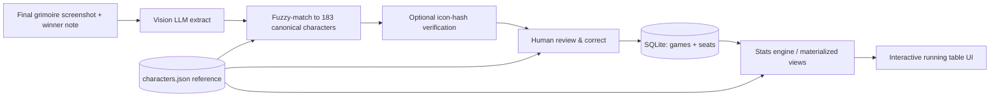

# Blood on the Clocktower — Win‑Rate Agent: Plan

A plan for an agent that ingests **final grimoire screenshots + a "who won" note** and
maintains an **interactive, running stats table** of win rates for every character and
every player.

This plan is grounded in data already scraped from the official
[Blood on the Clocktower Wiki](https://wiki.bloodontheclocktower.com/Main_Page) (see
[§1](#1-what-we-already-have-done)).

---

## 1. What we already have (DONE)

The wiki was scraped via its MediaWiki API (`scraper/scrape_wiki.py`, dependency‑free,
standard library only). Output lives in `data/`:

| Artifact | Contents |
| --- | --- |
| `data/characters.json` | **183** characters, each with `name`, `id`, `type`, `alignment`, `editions`, `ability`, `summary`, `flavour`, `artist`, `icon_file`, `icon_path`, `wiki_url` |
| `data/images/` | **195** images: every character icon (`Icon_*.png`), edition logos, generic type icons, alignment markers |
| `data/pages/*.wiki` | Raw wikitext mirror of all **205** content pages (rules, glossary, jinxes, strategy, etc.) — full reference corpus |
| `data/pages_index.json` | Every page with its categories + file path |
| `data/site_meta.json` | Site info, statistics, scrape timestamp, counts |

Character breakdown (the reference universe the agent must recognise):

- **By type:** 69 townsfolk · 24 outsider · 27 minion · 19 demon · 18 traveller · 14 fabled · 12 loric
- **By edition:** 23 Trouble Brewing · 25 Bad Moon Rising · 25 Sects & Violets · 83 experimental

> **Why this matters for the agent:** the screenshot reader will hallucinate or
> misspell character names. This canonical list lets us *constrain and validate*
> every detected character, auto‑derive its type/alignment/edition, and show the
> exact official icon next to each detection for human review.

To refresh the data later: `python scraper/scrape_wiki.py` (images are cached and skipped).

---

## 2. Goal & scope

**Input per game:** one (or more) screenshots of the *final* grimoire + a note: `good` or `evil` won.

**Output:** a continuously‑updated, browsable stats surface answering:

- Win rate **per character** (overall, and "good win % when this character is in play").
- Win rate **per player** (overall, by alignment, by character).
- Appearance/pick rates, survival rates, per‑script breakdowns.
- Drill‑downs: every game a character or player appeared in.

**Non‑goals (for v1):** live in‑game tracking, predicting roles, OCR of chat logs.
We only process *final* grimoires after a game ends.

---

## 3. The grimoire‑reading problem (and why it's the crux)

A final grimoire (official app / clocktower.online / web town squares) is a ring of
player seats. Each seat shows:

- **Player name** (text label).
- **Character token** (official art — the *same* art as our scraped `Icon_*.png`).
- **Reminder tokens** around the seat (DEAD, POISONED, IS THE DRUNK, "became", etc.).
- **Alive/dead state** (a shroud over the token; ghost‑vote token).

Because it's the *storyteller's* grimoire, tokens show **true** roles — there are **no
bluffs to disambiguate**. That makes extraction tractable.

### Extraction strategy (hybrid, in priority order)

1. **Primary — multimodal LLM (vision):** prompt a vision model with the screenshot and
   a tightly‑scoped schema (see [§5](#5-the-extraction-contract)). It returns a seat list:
   player name, character (free text), alive/dead, visible reminder tokens.
   **Model (chosen):** **Gemini 3.5 Flash** — #1 on MMMU‑Pro (83.6%) for dense image/OCR
   understanding *and* the fastest/cheapest, which matters for batch‑importing many games.
   Low‑confidence games auto‑escalate to **Gemini 3 Pro** (top‑tier structured spatial
   parsing). The call sits behind an `Extractor` interface so GPT‑5.5 / Claude Opus 4.6 can
   be swapped in without touching the pipeline.
2. **Grounding — fuzzy match to the canonical DB:** snap each detected character string
   to the nearest of our 183 names (normalized + Levenshtein/token match). Reject /
   flag matches below a confidence threshold.
3. **Verification — icon matching (optional, strong signal):** crop each token from the
   screenshot and compare against `data/images/Icon_*.png` via perceptual hash / embedding
   similarity. Used to confirm the LLM's read or to auto‑resolve ambiguous text.
4. **Human‑in‑the‑loop review (always):** present the parsed seats in a confirm screen
   with the matched official icon beside each — the user fixes any misreads before commit.
   This keeps the stats trustworthy; bad reads never silently corrupt the table.



---

## 4. Data model

Static **reference** data comes from `characters.json`. **Game** data is captured per ingest.
Recommended store: **SQLite** (single file, zero‑setup, great for ad‑hoc stat queries, ships
with Python).

```sql
-- Reference (loaded from data/characters.json on startup; read-only)
character(id PK, name, type, default_alignment, editions_json, ability, icon_path, wiki_url)

-- A single recorded game
game(
  id PK, played_at, script,              -- script inferred from detected chars or set by user
  player_count, winner CHECK(winner IN ('good','evil')),
  source_images_json, notes, created_at
)

-- One row per seat in a game's final grimoire
game_seat(
  id PK, game_id FK,
  player_name,                            -- normalized via player table
  player_id FK,
  character_id FK,                        -- STARTING role (default attribution)
  final_character_id FK NULL,             -- final token if it changed (star-pass, etc.)
  final_alignment CHECK IN ('good','evil'),-- defaults from type; overridable
  is_alive_at_end BOOL,
  reminder_tokens_json,                   -- raw tokens seen (audit trail)
  won BOOL,                               -- DERIVED: final_alignment == game.winner
  confidence REAL, needs_review BOOL
)

-- Canonical players + alias merging
player(id PK, canonical_name)
player_alias(player_id FK, alias)
```

### Win attribution rule (BOTC‑correct)

> When the game ends, **every player whose final alignment matches the winning team wins**,
> alive or dead.

So `seat.won = (seat.final_alignment == game.winner)`. Key consequences encoded in the model:

- **`final_alignment` is stored per seat, not just derived from type.** Defaults from the
  character's type (townsfolk/outsider → good; minion/demon → evil) but **must be
  overridable** for: **Travellers** (ST sets good/evil — read from token color), and
  experimental characters that **change alignment** mid‑game (e.g., Politician‑style turns).
- **Attribute to the STARTING role** (your choice). Win rate is credited to the character a
  player *began* the game as. A final grimoire shows the *end* state, so where the role
  changed (Imp star‑pass, Pit‑Hag/Imp creating roles, a Drunk's true role) the starting role
  must be recovered from reminder tokens (e.g. "IS THE DRUNK", "became") or set during review.
  We still store `final_character_id` for optional "final role" views, but **stats use the
  starting role**.
- **Alive/dead does not decide the win** — it's tracked separately for survival stats.
- **Fabled/Loric** seats are storyteller pieces, not players → excluded from player/character
  win rates by default (configurable).

---

## 5. The extraction contract

The vision step must return strict JSON so downstream code is deterministic:

```json
{
  "winner": "good",
  "script": "trouble_brewing",
  "seats": [
    {
      "player_name": "Alex",
      "character_text": "Fortune Teller",       // role on the final token
      "starting_character_text": "Fortune Teller", // inferred from reminders if changed; else same
      "alignment_hint": "good",
      "is_alive": false,
      "reminder_tokens": ["DEAD"],
      "confidence": 0.93
    }
  ]
}
```

Validation pass then produces a *resolved* proposal: both `*_character_text` fields →
`character_id` (+ canonical name, type, default alignment, icon) with a `match_score`;
anything below threshold is flagged `needs_review`. Because **stats use the starting role**,
the reviewer's main job is confirming `starting_character_text` for seats whose role changed.

---

## 6. Stats engine

Computed as SQL views / cached aggregates, recomputed (or incrementally updated) on each
new game commit. **All character win rates are keyed on the starting role** (per the
attribution decision):

- **Per character:** games_played, wins, losses, win% , appearances, "good‑wins‑when‑present%",
  survival%, split by script/edition.
- **Per player:** games, wins, win% , win% as good vs evil, most‑played characters,
  best/worst characters by win%.
- **Per player × character:** how a given player does on a given role.
- **Global:** overall good vs evil win rate, win rate by player count, by script.
- Small‑sample guardrails: show `n` and optionally hide/grey rates with `games_played < N`.

---

## 7. Interactive "running table" UI

Requirements implied by the prompt: **interactable** (sort, filter, search, drill‑down)
and **running** (updates live as games are added).

**Features**
- **Characters table:** icon · name · type · edition · games · W/L · win% · good‑when‑present% —
  sortable columns, filter by type/edition, text search, min‑games filter.
- **Players table:** name · games · wins · win% · win% good/evil · favourite roles.
- **Drill‑downs:** click a character → every game it appeared in; click a player → game history.
- **Ingest panel:** drop screenshot(s), pick winner, run extraction, review/correct, commit.
- **Live update:** new game → tables and charts refresh.
- **Export:** CSV/JSON for any table.

**Tech options** (recommendation marked ✅):

| Option | Pros | Cons |
| --- | --- | --- |
| ✅ **FastAPI + SQLite + small React/vanilla front end** | Full control of interactive tables, drill‑downs, ingest UX; clean API the agent calls | Most code |
| **Streamlit** | Fastest path to interactive sortable tables + image review | Less control over bespoke drill‑down UX |
| Static HTML reading a generated JSON | Trivial to host | No live ingest; manual rebuilds |

Recommendation: **FastAPI backend + SQLite + a lightweight React (or htmx/vanilla) front
end**, with the vision call behind a swappable `Extractor` interface (so the model can be
changed without touching the pipeline).

---

## 8. Proposed project layout

```
BotC/
├── data/                 # DONE — scraped reference (characters, images, wiki mirror)
├── scraper/              # DONE — scrape_wiki.py
├── app/
│   ├── reference.py      # load characters.json → in-memory DB + fuzzy matcher
│   ├── db.py             # SQLite schema + migrations
│   ├── extract/          # Extractor interface + vision implementation + icon-hash verifier
│   ├── ingest.py         # screenshot+winner → resolved proposal → commit
│   ├── stats.py          # win-rate aggregations / views
│   ├── api.py            # FastAPI routes (games, seats, stats, ingest, review)
│   └── web/              # interactive tables front end
├── tests/
│   └── fixtures/         # sample grimoire screenshots + expected JSON
├── PLAN.md
└── requirements.txt
```

---

## 9. Phased roadmap

- **Phase 0 — Data foundation. ✅ DONE.** Scrape + structured characters + icons + wiki mirror.
- **Phase 1 — Reference & DB. ✅ DONE.** `reference.py` (load `characters.json` + fuzzy matcher), `db.py` (SQLite schema + player/alias tables).
- **Phase 2 — Extraction + Excel import. ✅ DONE (Gemini wiring pending key).** `Extractor` interface + Gemini 3.5 Flash impl + offline stub; grounding/validation against the 183 canonical characters; `importer.py` Excel importer (auto‑detect columns, URLs/paths/hyperlinks, winner phrasing). Validated against a synthetic sheet.
- **Phase 3 — Commit. ✅ DONE.** `ingest.py` resolves → starting‑role attribution + derived `won` → `game`/`game_seat` rows; seats flagged `needs_review`. *Remaining:* a graphical review/correction screen.
- **Phase 4 — Stats engine. ✅ DONE.** `stats.py` character/player aggregations with min‑games guardrails.
- **Phase 5 — Interactive UI. ✅ DONE (core).** FastAPI (`api.py`) + single‑page table (`web/`): sortable/filterable characters + players, icons, drill‑downs, min‑games filter, auto‑refresh. *Remaining:* in‑browser ingest/review panel + CSV export.
- **Phase 6 — Polish.** Icon‑hash verification, alias merging UI, charts, multi‑image games, in‑UI review.

---

## 10. Decisions (locked) & remaining inputs

**Locked:**
1. **Vision model:** Gemini 3.5 Flash (default), escalate to Gemini 3 Pro for low‑confidence
   games; behind a swappable `Extractor` interface.
2. **Attribution:** **starting role**.
3. **Ingestion:** **batch import from an Excel sheet** — each row has a link to a grimoire
   image (or several) and a "good/evil won" note. This is the primary input path.

**Still need from you:**
- The **Excel file** itself (drop it in the workspace, e.g. `data/games.xlsx`). The importer
  auto‑detects columns and has an `inspect` mode to print what it found, but I need the real
  file to validate. Are the image links **URLs** or **local paths**, and is it **one image
  per game** or several?
- A **`GEMINI_API_KEY`** (env var) for real extraction. Until then a stub extractor lets the
  full pipeline + stats + UI run on placeholder data.

**Sensible defaults I've taken (tell me to change any):** travellers included in character
win rates (they have a real alignment), fabled/loric excluded; player names treated as stable
with alias‑merging available later; UI = FastAPI + SQLite + a light front end.

---

### Immediate next step

Build **Phase 1 + 2** behind a stub extractor (reference DB, fuzzy matcher, SQLite schema,
Excel importer with `inspect`, ingest pipeline, stats by starting role), then validate the
full `Excel row → image → resolved seats → stats` path once you drop in the real sheet and a
`GEMINI_API_KEY`.
